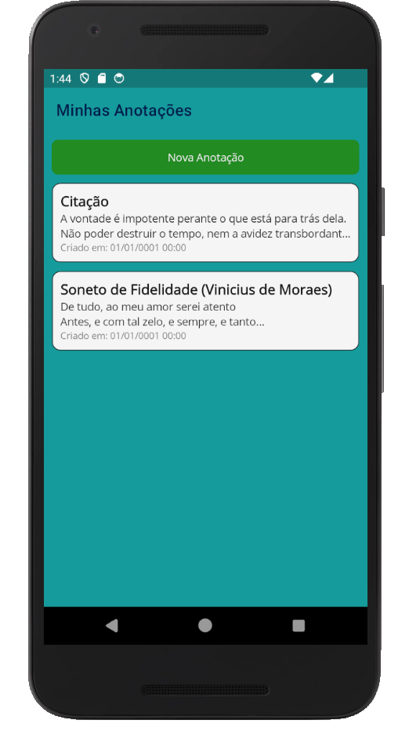
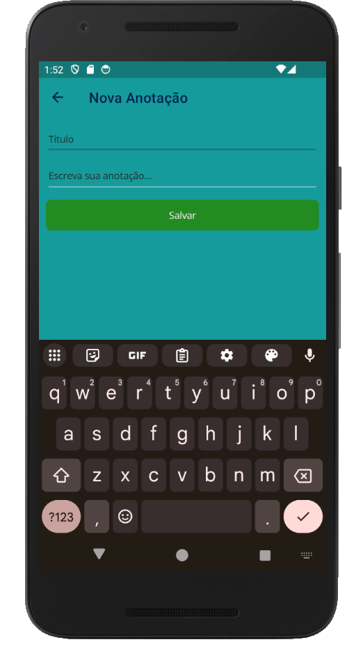
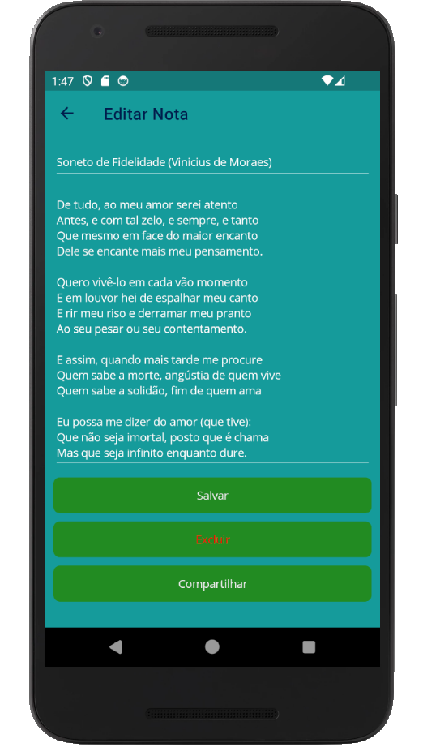
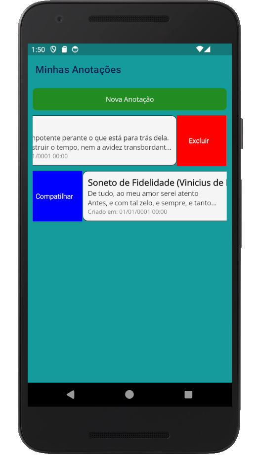

````markdown
# 📝 Minhas Anotações - .NET MAUI

**Minhas Anotações** é um aplicativo simples e direto para criar, editar e gerenciar anotações. Desenvolvido com [.NET MAUI](https://learn.microsoft.com/dotnet/maui/), o app funciona em Android, Windows e outras plataformas suportadas pelo MAUI.

## ✨ Funcionalidades

- Criar novas anotações com título e texto
- Editar e excluir anotações existentes
- Compartilhar anotações rapidamente
- Interface simples e intuitiva
- Confirmação ao tentar sair sem salvar alterações
- Persistência de dados local com SQLite (CRUD completo)

## 📱 Capturas de Tela

| Lista de Notas | Criando uma Nota |
|----------------|------------------|
|  |  |

| Editando uma Nota | Visualização Deslizante |
|-------------------|----------------|
|  |  |

## 🛠️ Tecnologias Utilizadas

- [.NET MAUI](https://learn.microsoft.com/dotnet/maui/)
- C#
- SQLite (via `SQLite-net`)
- MVVM (parcialmente)

## 🚀 Como Executar

1. Clone o repositório:

```bash
git clone https://github.com/ListaDeTarefas/MinhasAnotacoes.git
````

2. Abra a solução no Visual Studio 2022+ com suporte a MAUI instalado.

3. Selecione o alvo (Android Emulator, Windows Machine, etc).

4. Execute o projeto (`F5`).

## 📂 Estrutura do Projeto

* `Views/` – Telas do aplicativo (MainPage, NovaNotaPage)
* `Models/` – Classe `Nota`
* `Services/` – Serviço de banco de dados local (`NotaService`) com SQLite
* `Resources/` – Ícones e imagens do app

## 📌 Observações

* O botão voltar do sistema e da barra de navegação foi interceptado para exibir um alerta ao tentar sair com alterações não salvas.
* As notas são armazenadas localmente em banco de dados SQLite.

## 📄 Licença

Este projeto é open-source e está licenciado sob a [MIT License](LICENSE).

---

Desenvolvido com ❤️ em .NET MAUI.
